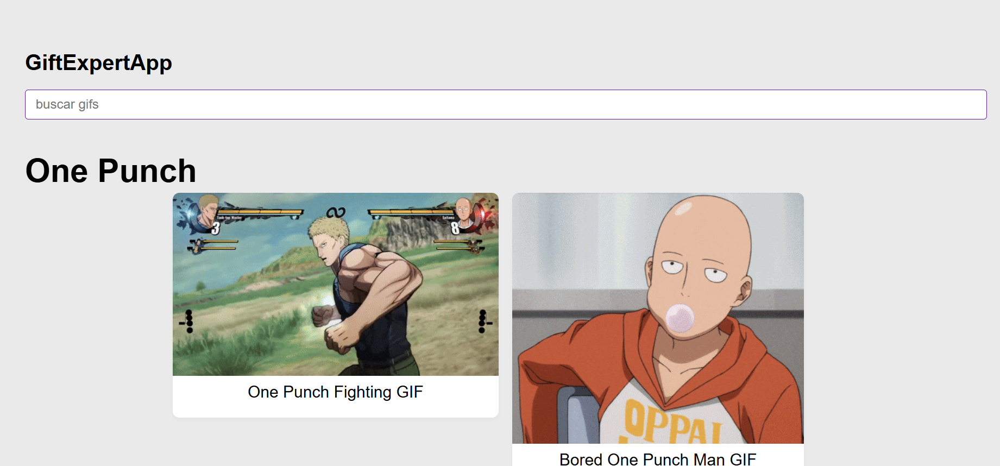

# GifExpertApp 

Este es mi proyecto de tarea del curso de Fernando Herrera 

## Funcionalidades 

Es una app que busca gifs haciendo peticion a una API
 

Desarrollado por [@Xgsusbrx](https://github.com/Xgsusbrx)
 